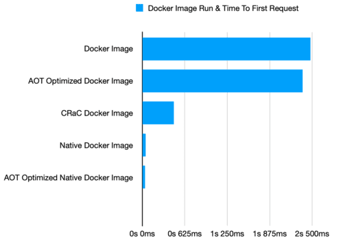

### Prepare VPC
```
add new user account:
adduser vabalas
usermode -aG sudo vabalas

from local machine:
ssh-copy-id vabalas@www.website.com

disable ssh password login:
vim /etc/ssh/sshd_config
PasswordAuthentication no
PermitRootLogin no
UsePAM no

also for hostinger:
vim /etc/ssh/sshd_config.d/50-cloud-init.conf

apply changes:
sudo systemctl reload ssh

firewall allow ports 22 80 and 443 only:
sudo ufw default deny incoming
sudo ufw default allow outgoing
sudo ufw allow OpenSSH
sudo ufw enable
```

`mvn package -Dpackaging=docker` -Dmicronaut.aot.enabled=true \
`mvn package -Dpackaging=docker-crac` \
`mvn package -Dpackaging=docker-native` -Dmicronaut.aot.enabled=true -Pgraalvm \
